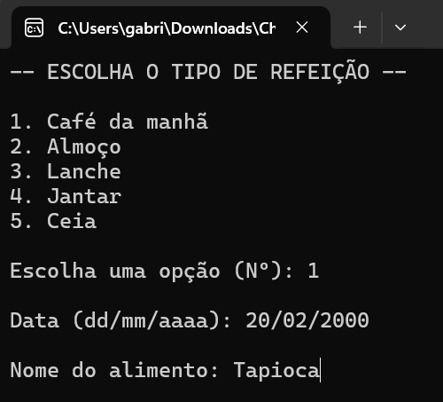
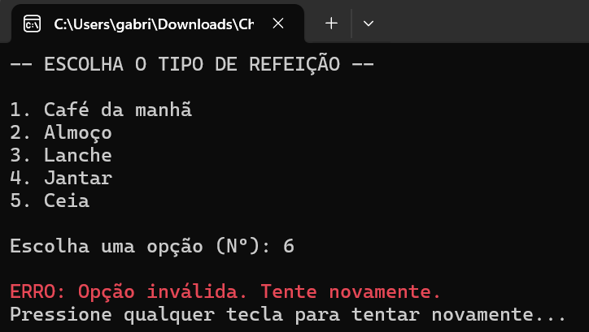
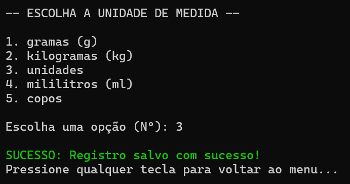

# Challenge CarePlus: Sistema de Registro Nutricional

## Integrantes:
Gabriel Souza Fiore – RM553710 

Guilherme Santiago – RM552321 

Miguel Leal Tasso – RM553009 

João Víctor Seixas – RM553888 

Lucca Enrico – RM553678 

## Descrição
O **Challenge CarePlus** é uma aplicação de console desenvolvida em C# (.NET 8.0) para auxiliar no registro e acompanhamento de refeições. O objetivo principal é permitir que o usuário categorize seus alimentos como "Saudável" ou "Ultraprocessado" e visualize estatísticas sobre seus hábitos alimentares.

## Funcionalidades
O sistema oferece um menu interativo com as seguintes opções:

1.  **Adicionar Refeição:** Permite registrar uma nova refeição, solicitando informações como:
    *   Tipo de refeição (Café da manhã, Almoço, Jantar, etc.)
    *   Data
    *   Nome do alimento
    *   Categoria (Saudável ou Ultraprocessado)
    *   Quantidade e Unidade de medida
2.  **Listar Registros:** Exibe todas as refeições registradas até o momento.
3.  **Exibir Estatísticas:** Apresenta um resumo nutricional, incluindo:
    *   Contagem de refeições Saudáveis e Ultraprocessadas.
    *   Distribuição percentual dos alimentos.
    *   Consumo diário de alimentos.
4.  **Sair:** Encerra a aplicação.

## Demonstração
Abaixo estão algumas telas da aplicação em execução, seguindo a ordem de uso:

### 1. Menu Principal
A tela inicial apresenta as opções principais do sistema.

### 2. Adicionar Refeição (Passo 1: Tipo de Refeição)
Ao escolher a opção "Adicionar refeição", o sistema solicita o tipo de refeição.

### 3. Adicionar Refeição (Passo 2: Detalhes)
Em seguida, são solicitados a data, nome do alimento e categoria.

### 4. Adicionar Refeição (Passo 3: Unidade de Medida)
Por fim, a quantidade e a unidade de medida são registradas.

### 5. Listar Registros
A opção "Listar registros" exibe todas as refeições salvas.

### 6. Exibir Estatísticas
A opção "Exibir estatísticas" mostra o resumo nutricional.

## Tecnologias Utilizadas
*   **Linguagem:** C#
*   **Framework:** .NET 8.0
*   **Plataforma:** Console Application
